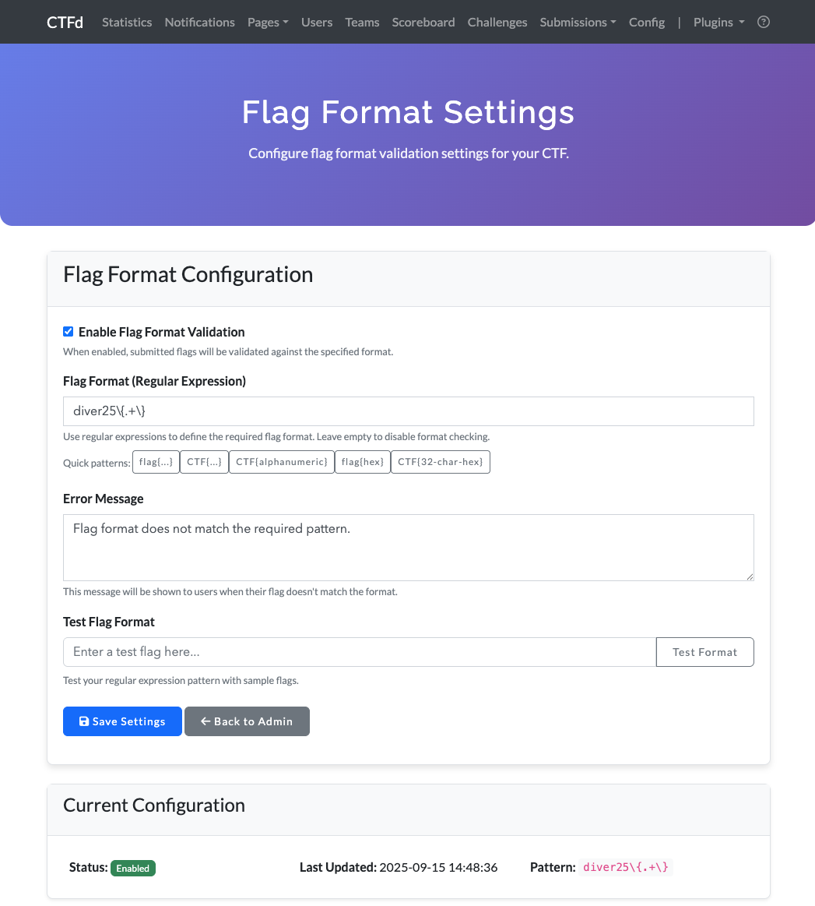
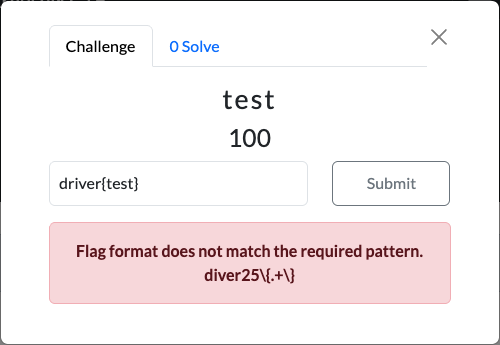

# CTFd Flag Format Checker

CTFd plugin that validates flag submissions against regex patterns.

  
  

## Installation

Copy to CTFd's plugins directory (`$CTFD_DIR/CTFd/plugins/`) and restart.

## Usage

Access `/admin/flag-format` to configure flag format validation:

1. Set regex pattern (e.g., `flag\{.*\}`)
2. Customize error message
3. Enable/disable validation
